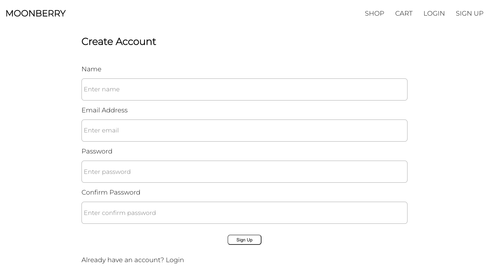
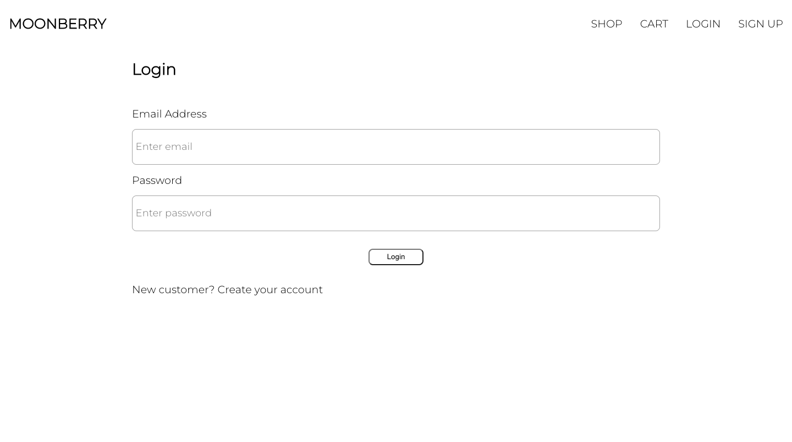
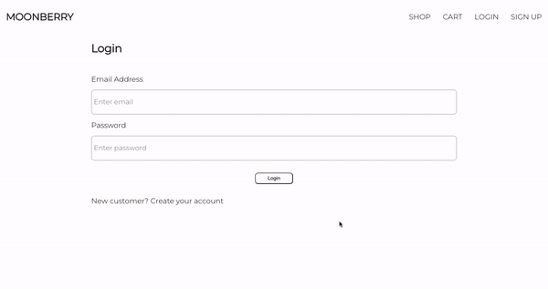
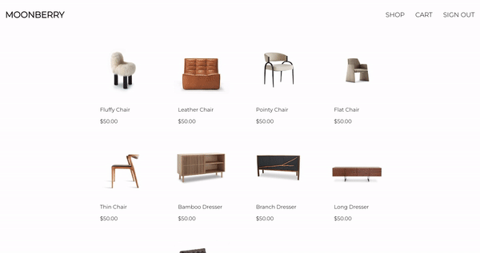
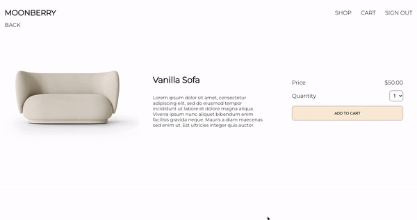
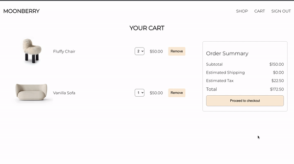
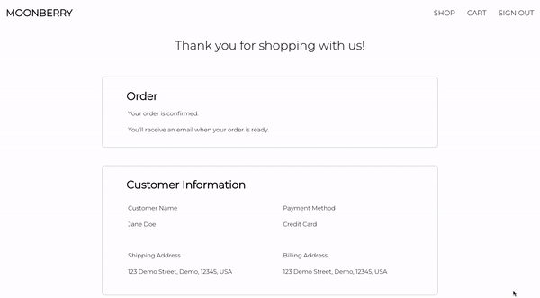

# Moonberry

Moonberry is an ecommerce site where users can browse and shop for aesthetic furniture. Users can create an account to interact with products by adding or removing them to their cart and purchasing them.

All features update the page the user is on without a refresh of the page through use of the Redux store.

## Live Site

[https://moonberry.fly.dev/](https://moonberry.fly.dev/)

## Tech Stack

# Features

## Home Page

## User Authentication

Users can create a new account to sign up or log into an existing account.

Unregistered users can browse products but will be directed to login when trying to checkout.

Once the user is logged in, they can view all items they had saved to their cart.

## Products

Users can see all available products in the shop. They can also click to view an individual product to read the description and add the item to their cart.

## Cart

A user can view all the items in their cart. They can also update the quanities of the items, remove items, and see a real-time update of their order summary.

## Checkout

Clicking checkout will direct a user to fill out a shipping form and payment information. They will also be provided with a summary of their order including:

- name of items
- quanitity of items
- shipping price
- tax price
- total price

## Confirmation

Users will see a confirmation receipt with the details they entered and an overview of their order.

